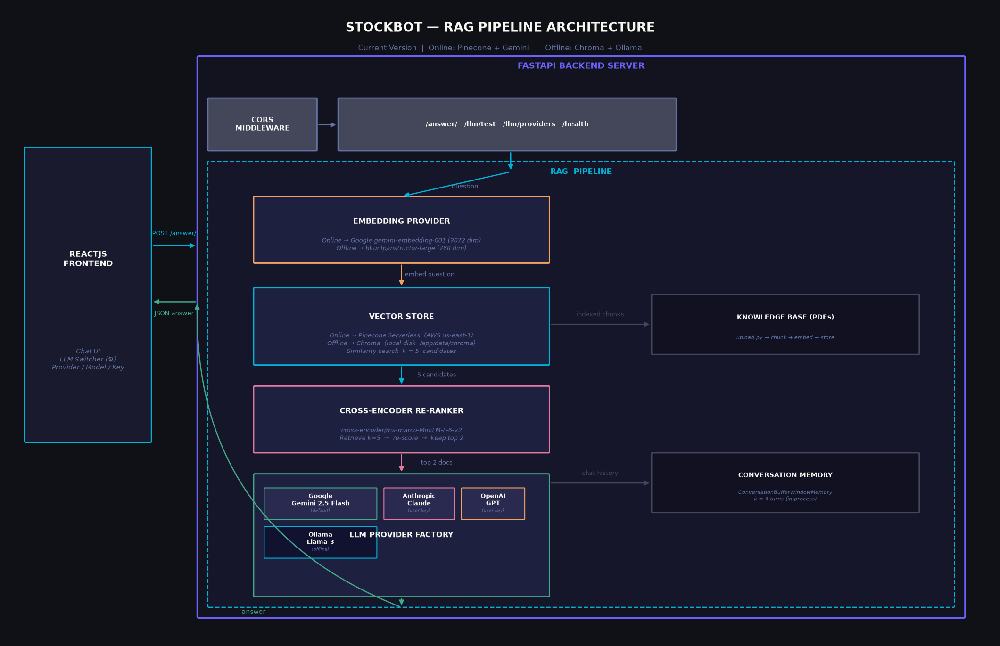
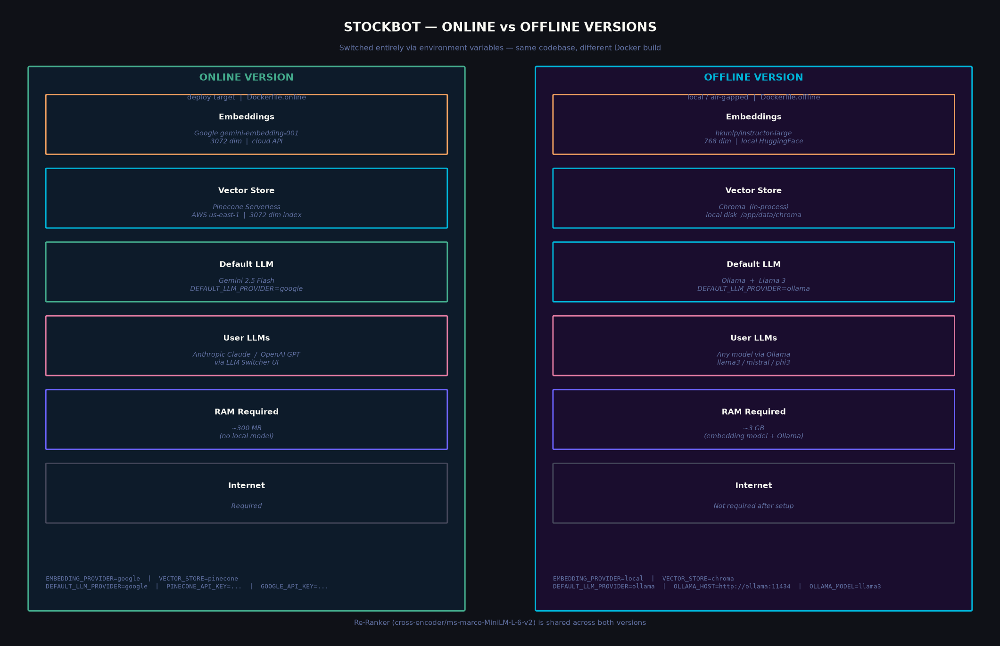

# StockBot — AI-Powered Stock Market Assistant

An intelligent chatbot that answers stock market and investing queries using **Retrieval-Augmented Generation (RAG)**. Ships in two configurations — a cloud-based **online version** and a fully local **offline version** — controlled entirely by environment variables.


---

## Architecture

### RAG Pipeline



### Online vs Offline Versions



---

## Features

- **Multi-LLM Support** — Switch between Google Gemini, Anthropic Claude, OpenAI GPT, or local Ollama from the UI
- **Bring Your Own Key** — Enter your API key, test the connection, and start chatting
- **Cross-Encoder Re-Ranker** — Retrieves k=5 candidates then re-scores with `ms-marco-MiniLM-L-6-v2`, keeping the top 2 for the LLM
- **Two Deployment Modes** — Online (Pinecone + Gemini) or Offline (Chroma + Ollama + local embeddings)
- **Conversation Memory** — Maintains context across the last 3 turns
- **Follow-up Suggestions** — Every answer ends with 2 logical follow-up questions
- **Structured Logging** — Rotating file + console logs for all requests and LLM interactions

---

## Tech Stack

| Layer | Online Version | Offline Version |
|---|---|---|
| **Frontend** | React 18, Material UI, Axios | ← same |
| **Backend** | Python 3.12, FastAPI, LangChain 0.3.x | ← same |
| **Embeddings** | Google `gemini-embedding-001` (3072 dim) | `hkunlp/instructor-large` (768 dim) |
| **Vector Store** | Pinecone Serverless | Chroma (local disk) |
| **Default LLM** | Google Gemini 2.5 Flash | Ollama + Llama 3 |
| **User LLMs** | Anthropic Claude, OpenAI GPT | Any Ollama model |
| **Re-Ranker** | `cross-encoder/ms-marco-MiniLM-L-6-v2` | ← same |
| **Deployment** | Docker, Railway (backend), Vercel (frontend) | Docker Compose (local) |

---

## Project Structure

```
StockBot/
├── server/
│   ├── app/
│   │   ├── main.py                  # FastAPI app, CORS, request logging middleware
│   │   ├── config.py                # All environment variable config
│   │   ├── routes.py                # /answer/ /llm/test /llm/providers /health
│   │   ├── logger.py                # Rotating file + console logger
│   │   └── services/
│   │       ├── rag.py               # RAG pipeline (retrieve → rerank → LLM)
│   │       ├── embedding_provider.py # Factory: google | local
│   │       ├── vector_store.py      # Factory: pinecone | chroma
│   │       ├── llm_provider.py      # Factory: google | anthropic | openai | ollama
│   │       └── memory.py            # ConversationBufferWindowMemory (k=3)
│   ├── scripts/
│   │   └── upload.py                # PDF ingestion (works for both stores)
│   ├── data/pdfs/                   # Source documents
│   ├── requirements.txt             # Shared base deps
│   ├── requirements.online.txt      # Cloud deps (pinecone, google-genai, etc.)
│   ├── requirements.offline.txt     # Local deps (chromadb, sentence-transformers, ollama)
│   ├── Dockerfile.online
│   └── Dockerfile.offline
│
├── client/
│   ├── src/
│   │   ├── components/
│   │   │   ├── LLMSettings.jsx      # Provider / model / API key switcher modal
│   │   │   ├── BotResponse.jsx      # Typewriter animation
│   │   │   └── ...
│   │   ├── services/api.js          # Axios client
│   │   └── pages/Home.jsx           # Main chat interface
│   └── Dockerfile
│
├── docs/
│   ├── ARCHITECTURE.md              # Full architecture reference
│   ├── arch_pipeline.png            # RAG pipeline diagram
│   └── arch_versions.png            # Online vs offline comparison
│
├── notebooks/                       # Reference notebooks (Gemini API, LLaMA 2)
├── docker-compose.yml               # Online version
├── docker-compose.offline.yml       # Offline version (includes Ollama sidecar)
└── .env.example
```

---

## Quick Start

### Online Version (Cloud)

**1. Backend**
```bash
cd server
python -m venv venv && source venv/bin/activate   # Windows: venv\Scripts\activate
pip install -r requirements.online.txt

cp .env.example .env
# Fill in: GOOGLE_API_KEY, PINECONE_API_KEY, PINECONE_INDEX_NAME
# Keep: EMBEDDING_PROVIDER=google, VECTOR_STORE=pinecone

# Ingest PDFs into Pinecone (one-time)
python scripts/upload.py

uvicorn app.main:app --reload
```

**2. Frontend**
```bash
cd client
npm install
npm start
```

**3. Docker (both services)**
```bash
docker-compose up --build
```

---

### Offline Version (Local)

```bash
# Start everything — Ollama + backend + frontend
docker compose -f docker-compose.offline.yml up --build

# First time only: pull the Llama 3 model into Ollama
docker compose -f docker-compose.offline.yml exec ollama ollama pull llama3

# Ingest PDFs into local Chroma store
docker compose -f docker-compose.offline.yml exec server python scripts/upload.py
```

---

## Environment Variables

### Online (`server/.env`)

| Variable | Required | Description |
|---|---|---|
| `GOOGLE_API_KEY` | Yes | Google Gemini API key (embeddings + default LLM) |
| `PINECONE_API_KEY` | Yes | Pinecone API key |
| `PINECONE_INDEX_NAME` | No | Index name (default: `stockbot`) |
| `EMBEDDING_PROVIDER` | No | `google` (default) or `local` |
| `VECTOR_STORE` | No | `pinecone` (default) or `chroma` |
| `DEFAULT_LLM_PROVIDER` | No | `google` (default) or `ollama` |
| `CORS_ORIGINS` | No | Comma-separated origins (default: `http://localhost:3000`) |

### Offline additions (`docker-compose.offline.yml`)

| Variable | Value |
|---|---|
| `EMBEDDING_PROVIDER` | `local` |
| `VECTOR_STORE` | `chroma` |
| `DEFAULT_LLM_PROVIDER` | `ollama` |
| `OLLAMA_HOST` | `http://ollama:11434` |
| `OLLAMA_MODEL` | `llama3` |

---

## API Endpoints

| Method | Endpoint | Description |
|---|---|---|
| `GET` | `/health` | Health check |
| `GET` | `/llm/providers` | List available providers and models |
| `POST` | `/llm/test` | Test an API key connection |
| `POST` | `/answer/` | Submit a question (with optional LLM config) |

### `/answer/` request body
```json
{
  "question": "What is momentum investing?",
  "provider": "anthropic",
  "model_name": "claude-sonnet-4-6",
  "api_key": "sk-ant-..."
}
```
`provider`, `model_name`, and `api_key` are optional — omitting them uses the server's default LLM.

---

## Supported LLM Models

| Provider | Models |
|---|---|
| **Google** | Gemini 2.5 Flash, Gemini 2.5 Pro, Gemini 2.0 Flash |
| **Anthropic** | Claude Sonnet 4.6, Claude Haiku 4.5, Claude Opus 4.8 |
| **OpenAI** | GPT-4o, GPT-4o Mini, GPT-4.1 |
| **Ollama (local)** | Llama 3, Llama 3 8B, Mistral, Phi-3 |

---

## Logging

Logs are written to `server/logs/stockbot.log` (rotating, 5 MB max, 3 backups) and stdout.

Each request logs: method · path · status · response time · question · vector search count · re-rank result · answer length · errors with full stack traces.

---

## License

MIT
